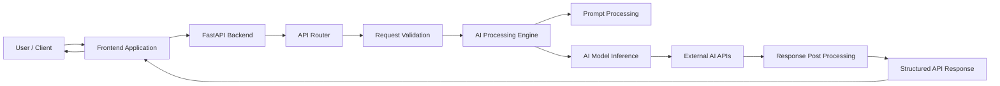
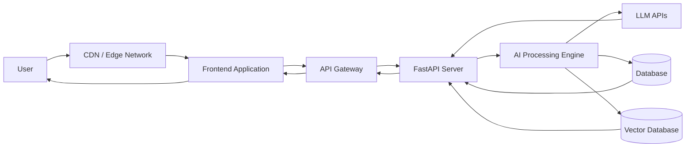
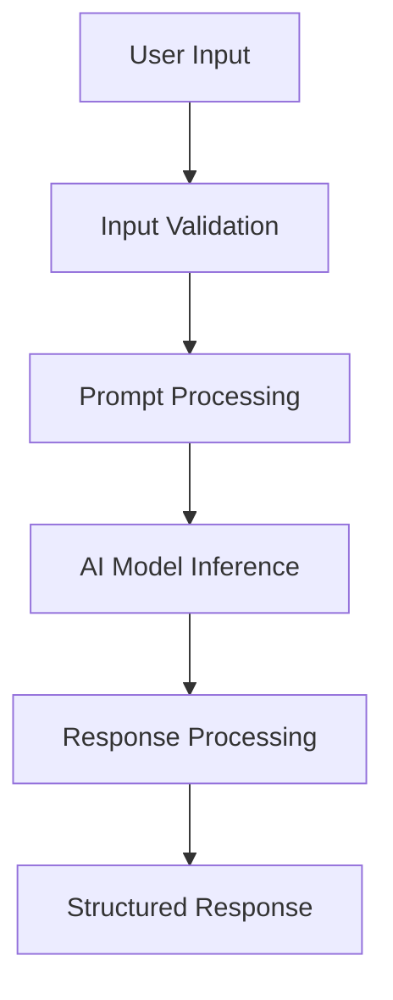
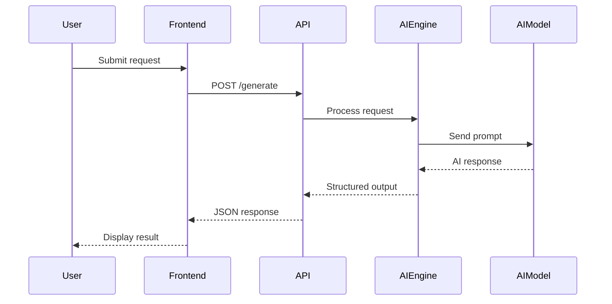

# 🧠 Personix AI

### Intelligent AI Assistant Platform for Personalized Insights


> **Personix AI** is an AI-powered backend system designed to generate personalized insights, intelligent responses, and contextual automation using modern AI models and scalable API architecture.

The system is designed to power **AI assistants, knowledge systems, automation tools, and intelligent productivity platforms**.

---

# 🚀 Overview

Personix AI provides a **modular AI backend architecture** capable of:

* Processing user inputs
* Generating AI-driven responses
* Integrating external AI services
* Providing scalable REST APIs
* Supporting intelligent automation workflows

The project focuses on building **production-ready AI infrastructure** that can be integrated with web apps, mobile apps, and enterprise systems.

---

# ✨ Key Features

### 🤖 AI-Powered Intelligence

* Context-aware text processing
* AI-driven response generation
* Personalized insights and recommendations

### ⚡ High Performance Backend

* Built using **FastAPI**
* Asynchronous API handling
* Scalable microservice-ready architecture

### 🔗 AI Integration

Supports integration with:

* LLM APIs
* NLP pipelines
* external AI services
* custom machine learning models

### 🧩 Modular Architecture

Clean separation between:

* API layer
* AI processing engine
* service layer
* utilities and helpers

This allows the system to remain **maintainable and extensible**.

---

# 🏗️ System Architecture



---

# ⚙️ Production Deployment Architecture



---

# 🧠 AI Processing Pipeline



Steps:

1️⃣ User sends request to API
2️⃣ Backend validates input
3️⃣ Prompt is processed and formatted
4️⃣ AI model generates response
5️⃣ Response is structured and returned

---

# 🔄 API Request Flow



---

# 📂 Project Structure

```
personix-ai
│
├── app
│   │
│   ├── api
│   │   ├── routes
│   │   └── endpoints
│   │
│   ├── core
│   │   ├── config.py
│   │   └── settings.py
│   │
│   ├── services
│   │   ├── ai_engine.py
│   │   └── processing.py
│   │
│   ├── models
│   │
│   └── utils
│
├── main.py
├── requirements.txt
└── README.md
```

---

# 🛠️ Tech Stack

### Backend

* Python
* FastAPI
* Uvicorn

### AI / Machine Learning

* LLM APIs
* NLP pipelines
* AI inference services

### Development Tools

* REST API architecture
* modular backend design
* virtual environments

---

# ⚙️ Installation

### 1️⃣ Clone the repository

```bash
git clone https://github.com/sivarajv04/personix-ai.git
cd personix-ai
```

---

### 2️⃣ Create virtual environment

```bash
python -m venv venv
```

Activate it:

**Windows**

```bash
venv\Scripts\activate
```

**Linux / Mac**

```bash
source venv/bin/activate
```

---

### 3️⃣ Install dependencies

```bash
pip install -r requirements.txt
```

---

# ▶️ Running the Project

Start the FastAPI server:

```bash
uvicorn main:app --reload
```

Server will run at:

```
http://127.0.0.1:8000
```

Interactive API documentation:

```
http://127.0.0.1:8000/docs
```

---

# 📡 API Endpoints

| Method | Endpoint    | Description               |
| ------ | ----------- | ------------------------- |
| GET    | `/`         | Health check              |
| POST   | `/generate` | Generate AI response      |
| GET    | `/docs`     | Swagger API documentation |

---

# 🔐 Environment Variables

Create a `.env` file:

```
OPENAI_API_KEY=your_api_key
AI_MODEL=gpt-4
```

---

# ☁️ Deployment

Personix AI can be deployed on:

### Render

Start command

```
uvicorn main:app --host 0.0.0.0 --port $PORT
```

---

### Docker

```
docker build -t personix-ai .
docker run -p 8000:8000 personix-ai
```

---

### Cloud Platforms

Supported deployment platforms:

* AWS
* Google Cloud
* Azure
* Render
* Railway
* DigitalOcean

---

# 🧪 Example Use Cases

Personix AI can power:

* AI personal assistants
* automated summarization tools
* intelligent chat systems
* productivity automation
* knowledge assistants
* AI-powered customer support bots

---

# 📈 Roadmap

Future enhancements:

* Retrieval-Augmented Generation (RAG)
* Vector database integration
* conversation memory
* user personalization
* streaming AI responses
* authentication system
* frontend dashboard

---

# 🤝 Contributing

Contributions are welcome.

Steps:

```
1 Fork the repository
2 Create a feature branch
3 Commit your changes
4 Open a pull request
```

---

# 👨‍💻 Author

**Sivaraj V**

AI Engineer | Machine Learning Engineer | AI Systems Developer

GitHub
[https://github.com/sivarajv04](https://github.com/sivarajv04)

LinkedIn
[https://linkedin.com/in/sivarajvofficial](https://linkedin.com/in/sivarajvofficial)

---

# 📜 License

This project is licensed under the **MIT License**.

---

⭐ If you find this project useful, please **star the repository**.

---

