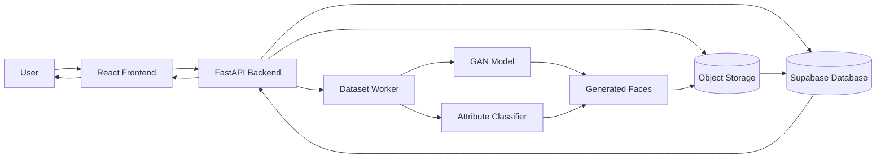
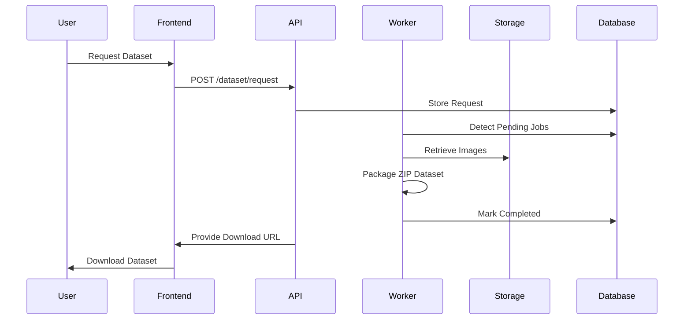
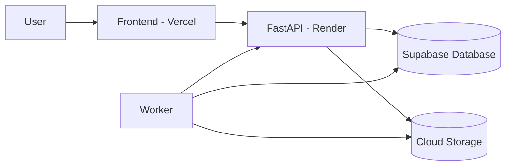

# 🧠 Personix AI

### Privacy-Preserving Synthetic Human Dataset Generation Platform


> **Personix AI** is an end-to-end synthetic human dataset generation platform that automatically produces, categorizes, packages, and securely delivers privacy-preserving facial datasets using generative AI models.

The platform behaves like a **synthetic data factory**, enabling researchers and developers to obtain **AI-generated human datasets without collecting real personal images**.

---

# 🌐 Live Demo

Frontend
👉 https://personix-ai.vercel.app

Backend API
👉 https://personix-api.onrender.com

API Documentation
👉 https://personix-api.onrender.com/docs

---

# 🚀 Project Overview

Training computer vision models typically requires large datasets of human faces.
Using real human data introduces **privacy, legal, and ethical concerns**.

Personix AI solves this by generating **synthetic human faces using GAN models**.

The system automatically:

• Generates synthetic faces
• Classifies them by attributes
• Stores them in categorized inventory
• Packages datasets on demand
• Delivers datasets instantly

---

# 🧠 Core Idea

Instead of generating faces **when users request them** (which is slow), the system maintains a **pre-generated inventory**.


This allows **instant dataset delivery without GPU inference during requests**.

---

# 🏗️ System Architecture



---

# 🔄 Dataset Request Flow



---

# ⚙️ System Components

## 1️⃣ Frontend Dashboard

Built with **React + Vite + TailwindCSS**

Features:

• Dataset request interface
• Request tracking
• Secure dataset download
• Bulk dataset request form
• Admin monitoring dashboard

---

## 2️⃣ FastAPI Backend

Handles:

• dataset request APIs
• secure downloads
• request queue management
• admin analytics endpoints
• monitoring endpoints

Example endpoints:

| Endpoint                        | Description                |
| ------------------------------- | -------------------------- |
| `/dataset/request`              | Create dataset request     |
| `/dataset/status/{id}`          | Track request              |
| `/dataset/download/{id}/{code}` | Secure dataset download    |
| `/admin/metrics`                | Admin dashboard statistics |
| `/admin/system-status`          | System monitoring          |

---

## 3️⃣ Dataset Worker System

Background workers perform heavy operations:

• dataset packaging
• inventory refill
• request queue processing
• ZIP dataset creation

Workers operate **independently of the API server**.

---

## 4️⃣ Synthetic Image Generator

Synthetic faces are generated using **GAN models** such as:

• StyleGAN2
• StyleGAN2-ADA

Generation pipeline:


---

## 5️⃣ Attribute Classification

Generated faces are automatically categorized using:

• DeepFace
• InsightFace

Extracted attributes:

• gender
• age group

This allows images to be organized for dataset requests.

---

# 📦 Inventory-Based Dataset System

Traditional GAN APIs generate images per request.

Personix AI uses **inventory-based generation**.


Benefits:

• instant response
• no GPU needed during requests
• scalable architecture

---

# 📊 Admin Monitoring System

The admin dashboard monitors system health and usage.


Tracked metrics:

• request queue size
• completed datasets
• packaging time
• download statistics
• inventory levels

Example monitoring snapshot:

```
{
  "queue": {
    "pending_jobs": 2,
    "completed_jobs": 30
  },
  "performance": {
    "avg_completion_seconds": 1537
  },
  "downloads": {
    "total_downloads": 10
  }
}
```

---

# ☁️ Deployment Architecture



---

# 📂 Project Structure

```
personix-ai
│
├── api
│   ├── server.py
│   ├── routes
│   │   ├── admin_routes.py
│   │   └── bulk_routes.py
│   ├── schemas.py
│   └── services.py
│
├── workers
│   ├── request_worker.py
│   ├── package_dataset.py
│   └── inventory_daemon.py
│
├── monitoring
│   ├── metrics_cache.py
│   ├── metrics_queries.py
│   └── health_rules.py
│
├── delivered_datasets
│
└── frontend
    └── React dashboard
```

---

# 🛠️ Tech Stack

### Backend

Python
FastAPI
Uvicorn

### Frontend

React
Vite
TailwindCSS

### Database

Supabase (PostgreSQL)

### Storage

Cloud Object Storage (R2 / S3)

### Machine Learning

StyleGAN2
StyleGAN2-ADA
DeepFace

---

# ▶️ Running the Backend

Clone repository

```
git clone https://github.com/sivarajv04/personix-ai.git
cd personix-ai
```

Create virtual environment

```
python -m venv venv
```

Activate environment

Windows

```
venv\Scripts\activate
```

Linux / Mac

```
source venv/bin/activate
```

Install dependencies

```
pip install -r requirements.txt
```

Run FastAPI server

```
uvicorn api.server:app --reload
```

Server

```
http://127.0.0.1:8000
```

API documentation

```
http://127.0.0.1:8000/docs
```

---

# 🔐 Environment Variables

Create `.env`

```
SUPABASE_URL=
SUPABASE_KEY=
ADMIN_PASSWORD=
STORAGE_BUCKET=
MODEL_PATH=
```

---

# 🧪 Example Use Cases

Personix AI can be used for:

• computer vision dataset generation
• privacy-safe AI training data
• face recognition research
• GAN research experiments
• AI benchmarking datasets

---

# 📈 Future Roadmap

Planned improvements:

• automated GAN retraining pipeline
• distributed worker cluster
• dataset marketplace
• advanced attribute classification
• GPU generation cluster
• dataset API rate limiting

---

# 👨‍💻 Author

**Sivaraj V**

AI Engineer | Machine Learning Engineer | AI Systems Developer

GitHub
https://github.com/sivarajv04

LinkedIn
https://linkedin.com/in/sivarajvofficial

---

# 📜 License

MIT License

---

⭐ If you find this project useful, please **star the repository**.


